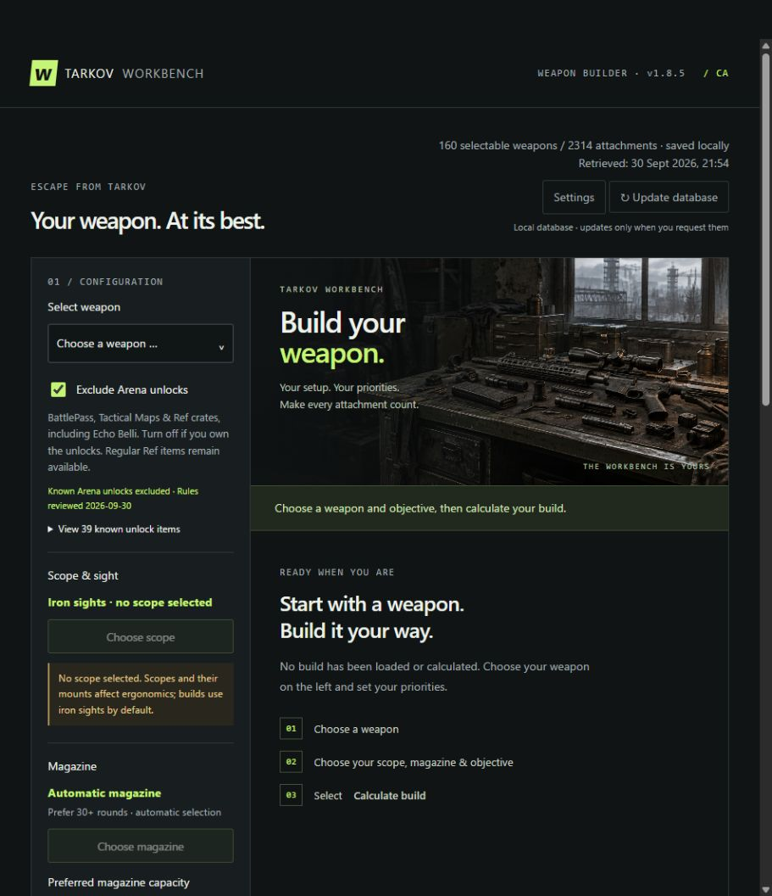
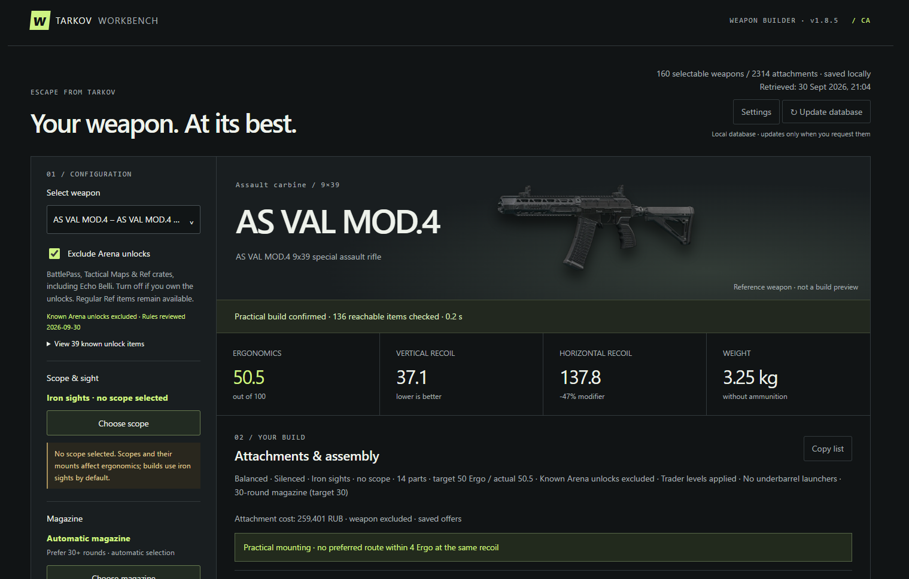
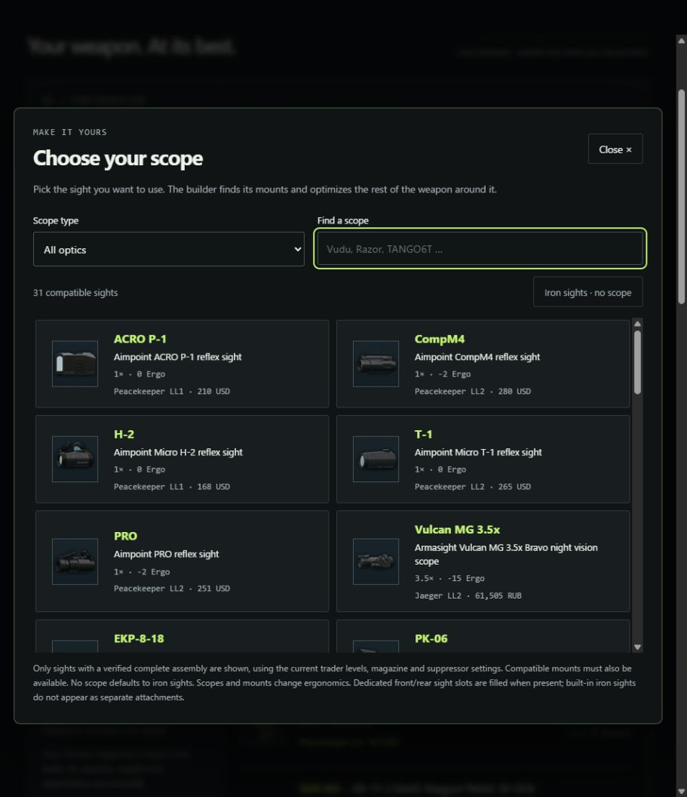
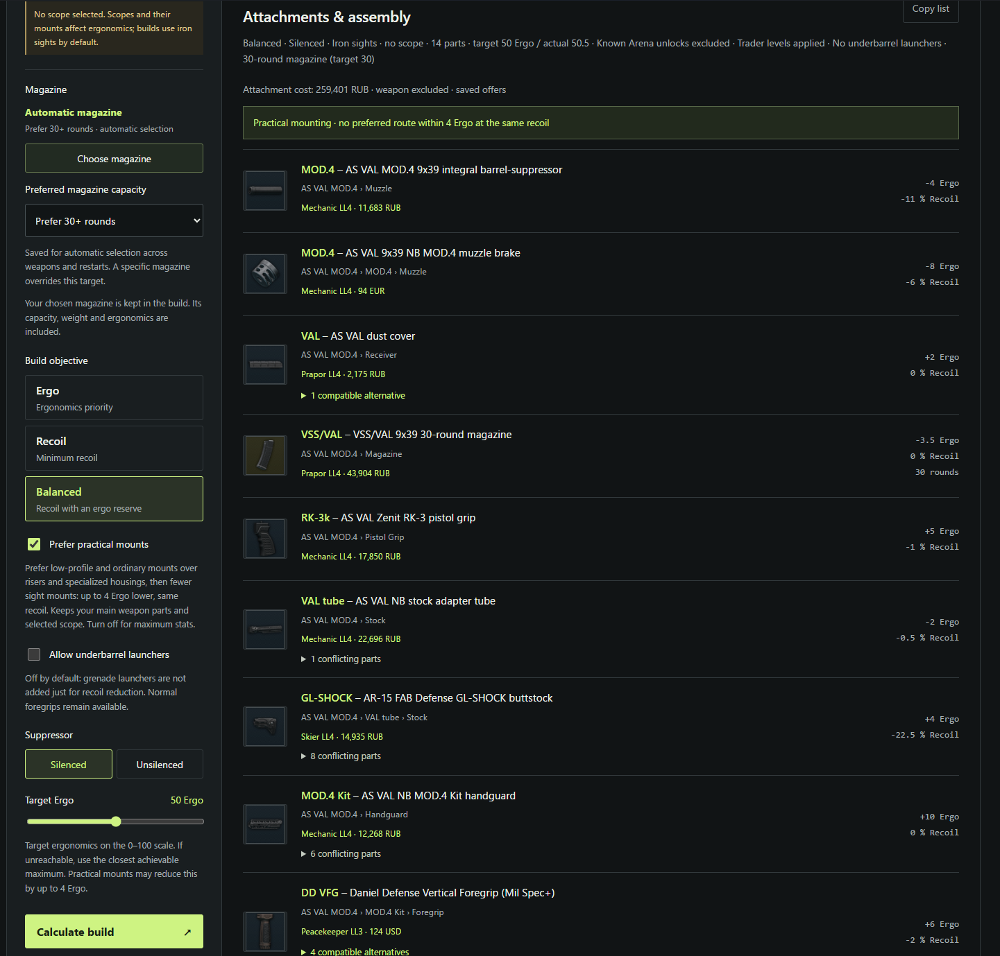

<p></p>

# Tarkov Workbench

An open-source Escape from Tarkov weapon builder for Windows. Choose how you want a weapon to perform, and Tarkov Workbench assembles a compatible build from locally saved community data.

## Download

**[Download the Windows portable ZIP](https://github.com/Chillnight/Tarkov-Workbench/releases/latest/download/Tarkov-Workbench-Online-Portable.zip)** · [Release notes and checksum](https://github.com/Chillnight/Tarkov-Workbench/releases/latest)

1. Extract the **entire** ZIP to a folder.
2. Run `Tarkov-Workbench.exe` from that folder. Keep its `resources`, `locales` and other runtime files beside the EXE.
3. On first launch, choose **Download data** if you want the app to retrieve the weapon database and item images. The app names the sources before making a request. Once setup finishes, your data is available offline.

The desktop app opens in its own window; it does not need a browser, an account or a separate Node.js installation. Use the Release ZIP above rather than GitHub's **Code → Download ZIP**, which contains source code. The Windows build is unsigned, so Smart App Control may block it on some PCs.

## Preview



## What it does

- **Three build goals:** **Ergo** prioritizes the highest ergonomics, **Recoil** the lowest recoil, and **Balanced** the lowest recoil while aiming for your Ergo target. Suppressed and unsuppressed builds are offered where the weapon supports them.
- **Compatibility-aware assembly:** the optimizer checks required parts, mounting chains, blocked slots and conflicting attachments before showing a build. A selected scope or magazine stays selected throughout optimization.
- **Your availability rules:** set trader loyalty levels, include or exclude barter and quest offers, and filter Arena unlocks you do not own. Quest and barter offers are included by default; known Arena unlocks are excluded. Trader prices are shown where available.
- **Practical choices:** ordinary, low-profile scope mounts are preferred when they stay close to the best achievable stats. Underbarrel launchers are off by default. Equivalent alternatives are offered only when the complete build remains compatible; equal-performing choices favor lower weight before price.
- **Readable result:** see ergonomics, recoil, weight, estimated attachment cost and a pictured parts list with short and full names, assembly paths and compatibility details.
- **Plan a purchase:** expand the trader shopping list to see required attachments grouped by vendor, with cash offers, barter ingredients and a copy button. Optionally set a maximum attachment budget in RUB; parts without a known value are excluded while the limit is on.
- **Choose your colors:** keep the original green interface or switch to Steel blue, Bourbon or Graphite in Settings.



## How to use

1. Open **Select weapon** and type inside the dropdown. Click a result, or use the arrow keys and Enter. For example, `Mod`, `Mod4` and `VAL MOD.4` find the AS VAL MOD.4. Escape closes the search without changing your selection. Weapons with no mountable attachments are hidden.
2. Optionally choose a pictured **scope**. Filter by red dot, 1–4×, 1–6×, 1–8×, other magnification or night/thermal sight. Only scopes with an available, compatible mounting path are offered. Leave it empty to use **iron sights**. Scopes and their mounts affect ergonomics.
3. Choose a specific **magazine** or keep automatic selection and set a preferred capacity. The builder checks that it fits the weapon and the rest of the assembly.
4. Select **Ergo**, **Recoil** or **Balanced**, then **Silenced** or **Unsilenced**. For Balanced, set a target Ergo on the 0–100 scale. If the target cannot be reached, the builder uses the closest achievable maximum instead of failing the build. Optionally enable **Maximum attachment budget** and enter a RUB limit.
5. Click **Calculate build**. The result lists each attachment with an image, short and full name, mounting path, stats and available trader offer. Expand the **Trader shopping list** to see where to buy the parts; it has a separate copy button. Expand alternatives or incompatibility details when you need them; **Copy list** exports the build as text.





The weapon image is a reference preset, not a 3D rendering of the calculated build. Results depend on the completeness and accuracy of the community data; game patches can arrive before that data is updated. Character skills, ammunition, durability, folded stocks and situational bonuses are outside the calculation.

The budget covers attachments and their required adapters, not the weapon or ammunition. It uses saved RUB-equivalent trader offers at your configured levels. Barter values are estimates rather than guaranteed cash prices; live stock and flea-market purchases are not checked. If no eligible build fits, raise or disable the limit. Color choices are local preferences and do not affect calculations.

Unavailable suppressor variants stay muted; click one for an explanation. Enter a positive whole-number budget when the limit is enabled. Invalid values and impossible build requirements show a popup, and your selected scope and magazine are kept so you can adjust your settings.

## Data and updates

The portable ZIP contains the app, but no downloaded Escape from Tarkov item database or item-image collection. At first setup, the app asks before retrieving item data and English names from `json.tarkov.dev` and required images from `assets.tarkov.dev`. It saves them under the Windows user profile (`AppData/Roaming/Tarkov Workbench`) for later offline use. Choosing **Stay offline** leaves the builder empty until you start setup through **Update database**.

**Update database** is manual. It validates a new snapshot before replacing the active one; a failed or cancelled update keeps your previous data. A changed database clears calculated results so you can recalculate with current parts. Feature and compatibility-rule changes still require a new app release. See [data updates](docs/UPDATES.md) for details.

## Build from source

The repository contains the application, tests and packaging scripts. Downloaded game data, item images, generated ZIPs and local signing files are excluded. On Windows with Node.js and npm:

```text
npm ci
npm test
npm run portable:online
```

The last command creates `Tarkov-Workbench-Online-Portable.zip` and `Online-Portable/` without bundling downloaded item data or images. For local browser development or an offline snapshot build, follow [source setup](docs/SOURCE-SETUP.md). Additional details: [traders and loadout](docs/TRADERS-AND-LOADOUT.md), [practical mounts](docs/PRACTICAL-MOUNTS.md), [availability rules](docs/AVAILABILITY.md), and [distribution](docs/DISTRIBUTION.md).

## Sources and license

Weapon and item data comes from the community-maintained [tarkov.dev data project](https://github.com/the-hideout/tarkov-data-manager); the app's download flow uses the [tarkov.dev API and exports](https://tarkov.dev/api/). The [Escape from Tarkov Wiki](https://escapefromtarkov.fandom.com/wiki/Escape_from_Tarkov_Wiki) is a reference for manual compatibility checks. Optimization uses [HiGHS](https://github.com/lovasoa/highs-js); the desktop runtime uses [Electron](https://www.electronjs.org/). Their license notices are preserved in the source or packaged app.

Our own source code is licensed under [MIT](LICENSE). This license does not cover Escape from Tarkov game content, item images, names or trademarks, or override third-party licenses. Tarkov Workbench is an independent community tool and is not operated by Battlestate Games.
